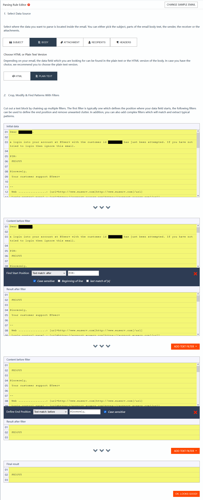
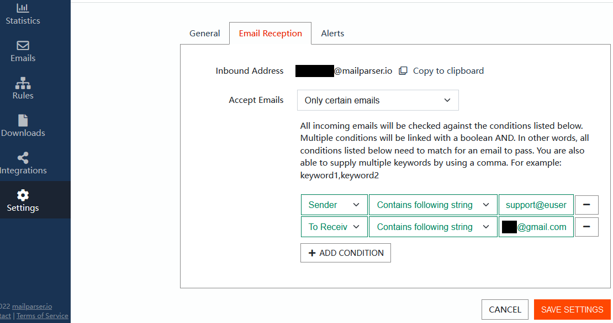

### Mailparser Settings

1. Register [Mailparser](https://mailparser.io) account firstly.

2. (**login pin**) Create a new inbox for receiving login pin emails, if you choose mailparser as the sender of the login pin.

3. (**login pin**) Create data parsing rules for login pin, , if you choose mailparser as the sender of the login pin.
   - mailparser_data_parsing_rules, `pin` is required, other fields is optional.
     
   - mailparser_data_parsing_rules_pin
     
4. (**login pin**)Create parsed data download url, if you choose mailparser as the sender of the login pin. Same as the following 8.
5. (**login pin**) Settings(optional), , if you choose mailparser as the sender of the login pin.
     Similarly,

6. (**renew pin **) Create another new inbox for receiving renew pin emails, if you choose mailparser as the sender of the renew pin.

7. (**renew pin**) Create data parsing rules for renew pin, , if you choose mailparser as the sender of the renew pin.
   - mailparser_data_parsing_rules, `pin` is required, other fields is optional.
     
   - mailparser_data_parsing_rules_pin
     
   - mailparser_data_parsing_rules_subject
     
   - mailparser_data_parsing_rules_sender
     
   - mailparser_data_parsing_rules_receiver
     
   
8. (**renew pin**)Create parsed data download url, if you choose mailparser as the sender of the renew pin.
   - mailparser_parsed_data_downloads
     
   - mailparser_parsed_data_downloads_setting
     
   
9. Settings(optional)
   - mailparser_inbox_setting_1
    
   - mailparser_inbox_setting_2
    