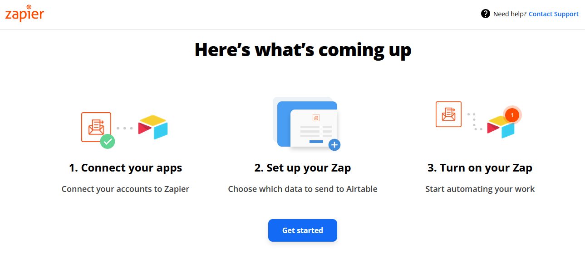
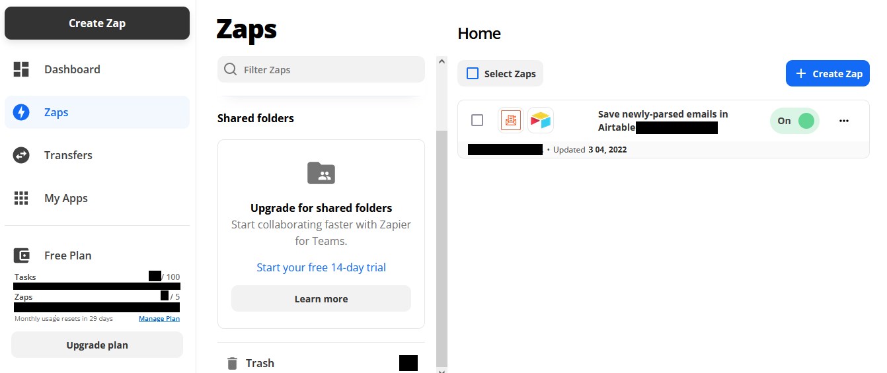

### Zapier + Airtable Settings

1. Register [Zapier](https://zapier.com) account firstly.

2. Open [Parse Emails by Zapier](https://parser.zapier.com) to create inbox for receiving pin, one is for login pin (if you choose ZapierAirtable as the sender of the login pin), another is  for renew pin(if you choose ZapierAirtable as the sender of the renew pin).

3. Then register [Airtable](https://www.airtable.com) account for get parsed pin from Zapier.

4. Copy [this base](https://airtable.com/shrEhds9q0oVW1RS1) into your Airtable workspace.

   

5. Create Zap to connect zapier and airtable via [this zap template](https://zapier.com/webintent/create-zap?template=7321). If you choose `ZapierAirtable` as the sender of the login pin, you need create Zap for login pin. If you choose `ZapierAirtable` as the sender of the renew pin, you need create another Zap for renew pin.

   
   

**Tips.**

1. get your Airtable base id from https://airtable.com/api for `AIRTABLE_BASE_IDS`. Or you can find it in your base URL when you open it in browser.
2. get your Airtable API key from https://airtable.com/account for `AIRTABLE_API_KEY` .